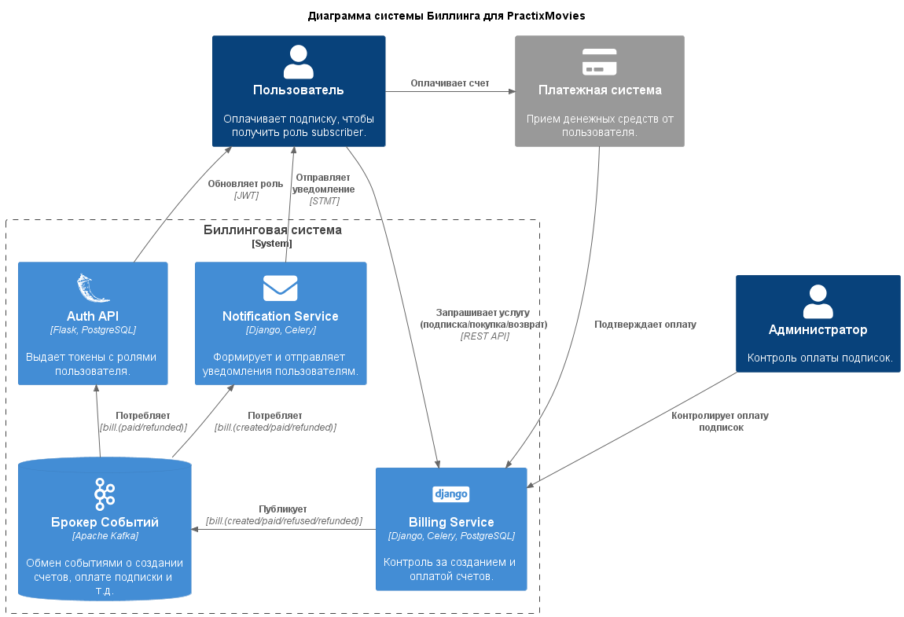
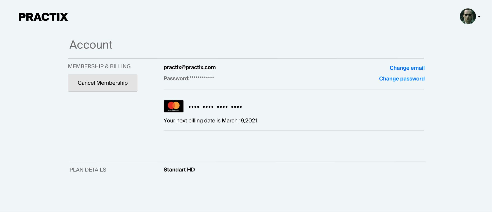

[](https://github.com/TreOne/billing/actions/workflows/auth-api.yml)  
[](https://github.com/TreOne/billing/actions/workflows/billing.yml)  
[](https://github.com/TreOne/billing/actions/workflows/event-to-notification.yml)  
[](https://github.com/TreOne/billing/actions/workflows/notification-api.yml)  
[](https://github.com/TreOne/billing/actions/workflows/notification-sender.yml)  
[](https://github.com/TreOne/billing/actions/workflows/film-api.yml)  

# Дипломный проект - Биллинг
* [Видео с защитой диплома](https://youtu.be/_yiM9dZ-0Lo?t=1207)
* [Гугл презентация](https://docs.google.com/presentation/d/1zgzUlYobH0WnlucSsCk1m3a8R46EA3R9pMqVZWRCNVs/edit?usp=sharing)

## Задание
Реализовать два метода работы с картами:
1. Оплатить подписку
2. Отменить подписку и вернуть за нее деньги

Система должна быть устойчива к перебоям (строго однократная доставка).  
Интеграция с админкой Django (контроль оплаты подписок клиентами).  

## Архитектура проекта


## Экраны в клиентском приложении


## Запуск проекта
Запустить основную инфраструктуру проекта
```shell
docker-compose -f docker-compose.yml up --detach
```
Дождаться запуска контейнера **kafka**, затем запустить остальные сервисы:
```shell
docker-compose -f services/auth_api/docker-compose.yml up --detach
docker-compose -f services/billing/docker-compose.yml up --detach
docker-compose -f services/event_to_notification/docker-compose.yml up --detach
docker-compose -f services/notification_api/docker-compose.yml up --detach
docker-compose -f services/film_api/docker-compose.yml up --detach
```

## Что потыкать
**AuthAPI Swagger** http://localhost:5010/swagger-ui  
**NotificationAPI Swagger** http://localhost:5030/openapi  
**Billing Swagger** http://localhost:5020/api/schema/swagger-ui  
**Billing Django** http://localhost:5020/admin (логин: `admin`, пароль: `admin`)  
**Billing Flower** *(Celery monitor)* http://localhost:5555  
**Kibana (logs)** http://localhost:5601  
